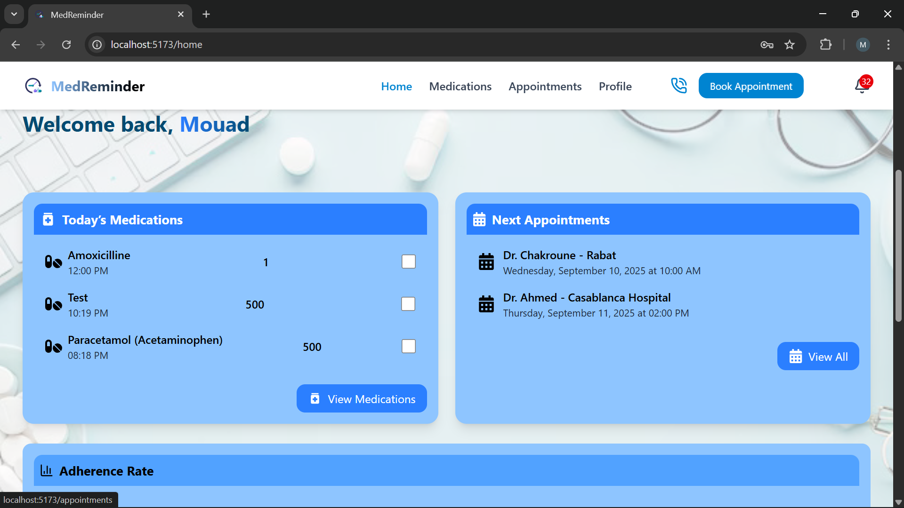
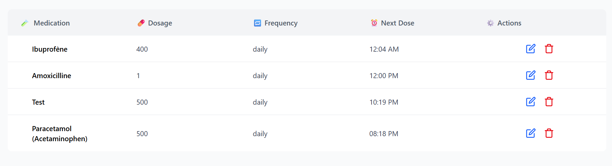
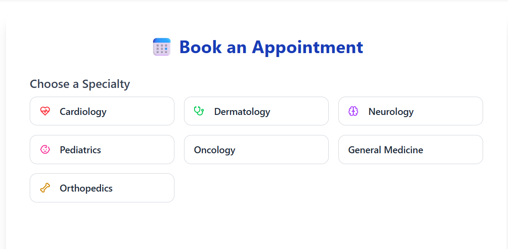
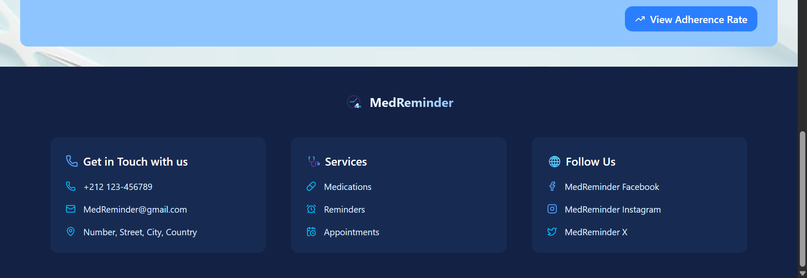

# 📋 MedReminder – Medication & Appointment Management System

## 📌 Overview
**MedReminder** is a full-stack web application designed to help patients manage their medications and medical appointments effectively. The application sends reminders to ensure medication adherence and timely attendance of appointments, improving healthcare management for individuals, especially those with chronic conditions.

---

## ✨ Key Features

### 👤 User Management
- User registration and secure authentication using JWT
- Personal profile management (update info, view history)

### 💊 Medication Management
- Add, edit, and delete medications
- Set dosage, frequency, and intake times
- Daily medication reminders
- View today's medications and adherence history

### 🗓️ Appointment Management
- Book appointments with doctors by specialty, city, and date
- View upcoming and past appointments
- Receive appointment reminders via notifications
- Manage appointment status (Upcoming, Done)

### 🔔 Smart Notifications
- In-app notifications for medications and appointments
- Email reminders for upcoming events
- Multi-channel reminder system

### 📊 Dashboard & Analytics
- Personalized dashboard with today's medications and next appointments
- Adherence rate tracking
- Medication intake history

---

## 🖼️ Screenshots

> All screenshots are stored in the `screenshots/` folder.

| **Sign Up Page** | **Dashboard** | **Medication List** |
|------------------|---------------|-------------------|
|  |  |  |

| **Book Appointment** | **Appointments List** | **Add Medication** |
|--------------------|---------------------|------------------|
|  |  |  |

| **Specialty Selection** | **Appointment Details** | **Footer** |
|------------------------|-----------------------|------------|
|  |  |  |

---

## 🛠️ Technology Stack

### **Frontend**
- **React** – UI framework
- **Tailwind CSS** – Styling and responsive design
- **JavaScript/TypeScript** – Frontend logic
- **Vite** – Build tool
- **Axios** – API calls
- **React Router** – Navigation

### **Backend**
- **NestJS** – Node.js framework for scalable backend
- **Prisma ORM** – Database management and migrations
- **JWT / Passport** – Authentication and authorization
- **Socket.IO** – Real-time notifications
- **Bull / Redis** – Background jobs for reminders

### **Database**
- **MongoDB** – NoSQL database

### **DevOps & Deployment**
- **Docker** – Containerization
- **Docker Compose** – Multi-container orchestration

---

## 📁 Project Structure

medreminder/
├── frontend/
│ ├── src/
│ │ ├── components/
│ │ ├── pages/
│ │ ├── services/
│ │ └── styles/
│ └── public/
├── backend/
│ ├── src/
│ │ ├── modules/
│ │ ├── guards/
│ │ ├── services/
│ │ └── prisma/
│ └── docker/
├── screenshots/ # Project screenshots
├── docker-compose.yml
└── README.md

yaml
Copy code

---

## 🚀 Getting Started

### Prerequisites
- Node.js (v18+)
- Docker & Docker Compose

### Installation & Running

1. **Clone the repository**
   ```bash
   git clone https://github.com/yourusername/medreminder.git
   cd medreminder
Backend Setup

bash
Copy code
cd backend
npm install
npx prisma generate
npx prisma migrate dev
Frontend Setup

bash
Copy code
cd frontend
npm install
Run with Docker (Recommended)

bash
Copy code
docker-compose up --build
Frontend: http://localhost:5173

Backend API: http://localhost:3000

Run without Docker

bash
Copy code
# Backend
cd backend && npm run start:dev

# Frontend (in another terminal)
cd frontend && npm run dev
📈 Future Enhancements
Mobile App (React Native / Flutter)

AI-Powered Recommendations for medication timing

Family Sharing – Allow family members to monitor adherence

Telemedicine Integration – Virtual consultations

Analytics Dashboard for healthcare providers

Multi-language Support

Voice-Activated Reminders (Google Assistant/Alexa integration)
